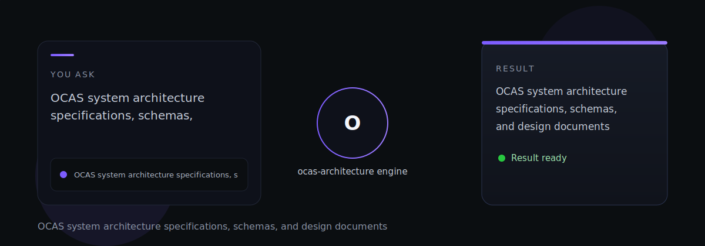

# ocas-architecture

ocas-architecture — OCAS system architecture specifications, schemas, and design documents

> Tell it what you need. It does the work.

---

*ocas-architecture is part of the [OCAS Agent Suite](https://github.com/indigokarasu).*