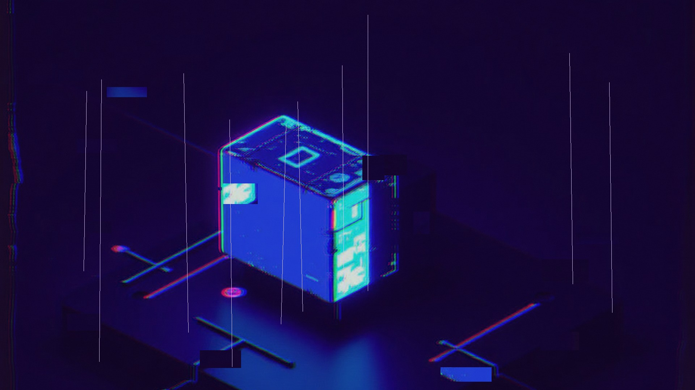

# ocas-architecture

<p align="center">
  
</p>

Normative architecture, schemas and integration contracts for the OCAS agent suite.

## Current architecture

OCAS v2 uses Chronicle as the principal-scoped durable memory/context substrate. User memory and agent autobiographical identity are separate ownership domains. User Dreaming consolidates knowledge about the user only; the agent's autobiographical growth system remains independent.

The canonical component lifecycle registry is `components.json`.

### Normative v2 contracts

- `spec-ocas-architecture.md` — system model and invariants
- `spec-ocas-principals-and-memory-boundaries.md` — user/agent ownership, retraction and erasure
- `spec-ocas-interfaces.md` — typed cross-component communication
- `spec-ocas-storage-conventions.md` — private state, queues, exports and runtime-owned storage

Older specs remain useful migration inputs until promoted to v2; they do not override the normative contracts above.

## Validation

Run:

```bash
python scripts/validate_architecture.py
```

CI runs the same validator on pushes and pull requests. A spec should be added to the validator's `NORMATIVE` set when it has been migrated to v2; from that point, reintroducing retired architecture into that contract fails CI.

## Design rules

- Every durable personal-memory write has an explicit principal.
- Evidence may be shared across authorized domains; derived identity may not be conflated.
- Component-private data directories are not APIs.
- Journals are immutable evidence, not automatically durable memory.
- Retired components remain registry history, never active dependencies.

---
## License
MIT License.
